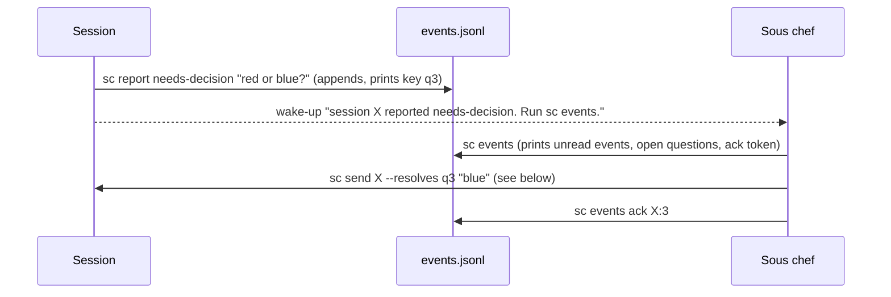

# Messaging

How sessions and sous chef tell each other things. Both directions work the same way: the message is written to a file first, then the other side gets a one-line wake-up telling it to read. The file is what counts; the wake-up can be lost and the watcher sends it again.

Code: `src/events.ts` (including `CRON_LOG`, `CONTEXT_LOG`, `SLACK_LOG` and `SYNC_LOG`), `src/inbox.ts`, `lib/sc/wake.py`, `src/chef.ts`, `src/ops.ts` (`report`, `send`, `currentSessionRecord`). `lib/sc/wake.py` is the Python Claude runtime's wake-up, still in the tree; TypeScript has no equivalent yet, and the TypeScript Claude runtime arrives with TRV-1155 (the Claude runtime on Porch).

Paths such as `state/...` in this doc are in the owner's data folder, which the core reaches as `my/` (`docs/architecture.md`, "Two folders joined by one link").

## Session to sous chef: the event log

Each session's `events.jsonl` holds one JSON object per line: `seq`, `ts`, `author`, `state`, `text`, and optionally `key` and `waiting_on`. `events.append` takes a per-session lock and numbers events in order.

**Authors.** `session` (through `sc report`), `sc` (sous chef's own commands: `launched`, `resolved`, `marked`, `stopped`, `resumed`, `failed`), `watcher` (`gone`, `auto-resumed`, `prompt-waiting`, `prompt-answered`, `silent-stop`, `inbox-unread`), `cron` (`due` and `failed`, only in the cron log below), `context` (`context-high`, `context-unreadable` and `context-readable`, only in the context log below), and `slack` (`message`, `reply`, `mention` and `thread-reply`, only in the slack log below).

**States a session can report** are listed in `events.SESSION_STATES` and explained in the brief: `working`, `needs-decision`, `blocked`, `waiting`, `paused`, `done`, `failed`, `resolved`, `note`, and `nothing-new`. `nothing-new` is only accepted from a session a scheduled job launched (its record has `cron`), whose extra brief section explains it: the job found nothing worth reporting. It does not wake sous chef and sets waiting on to `nobody`; see `docs/domains/cron.md`. `sc report` refuses anything else, and refuses a `note` whose text matches `events.READS_AS_QUESTION` — a question reported as a note has no key, so it is never an open question and nobody learns the session is waiting. The check matches the literal state name only, so an ordinary note that mentions a decision in passing still goes through.

**Who is calling.** `ops.currentSessionRecord` finds the session whose recorded Claude session id matches `CLAUDE_CODE_SESSION_ID`, which Claude Code sets itself. A session never passes its own id, so it cannot write into another session's log, and a stale variable from a reused process cannot misdirect it. See "Which session is calling" in `docs/domains/sessions.md`.

**Wake-ups.** States in `events.WAKE_STATES` (everything except `working`, `note` and `nothing-new`) wake sous chef. `resolved` is included, because a session reports it when the owner answered a question inside the session, and sous chef would otherwise never learn the question closed. Of the watcher's events, all wake sous chef except `prompt-answered`, which only says that a prompt reported earlier is no longer open, and `auto-resumed`, which says the watcher resumed a session that stopped while idle (a failed resume is reported as `gone`, which does wake). A wake-up through `chef.wakeChef`, which posts to the session registered in `state/chef.json`. If sous chef is not running, nothing is lost: the event is on disk and appears in the next startup summary.

**Notes do not wake, but they are not invisible.** A `note` needs no action, so it must not interrupt, and it stays out of `WAKE_STATES` and out of the watcher's retries. It is still counted separately in the startup summary (`Unread notes (no action needed): N`), so it is picked up at the next start, resume or compaction. Before that count existed a note surfaced only in `sc events`, which sous chef had no reason to run, so notes could sit unread indefinitely.

## The cron log: scheduled jobs for sous chef

Sous chef has no inbox. A scheduled job meant for sous chef itself is written to one more event log, `state/cron/events.jsonl`, known in code as `events.CRON_LOG` (`cron`), which can never be a session id. It uses the same functions as a session's log (`events.append`, `unread`, `ack`), so:

- `sc events` lists its unread events under `[cron]`, and its ack token part is `cron:<n>`;
- `due` (a job for sous chef fired) and `failed` (a job's worker could not be launched) are in `WAKE_STATES`, so the startup summary counts them;
- writing them wakes nobody. The watcher wakes sous chef for them once it is idle, and retries until they are acknowledged (check 7 in `docs/domains/watcher.md`), so a job waits for the end of a turn instead of interrupting it.

It has no waiting on and no open questions. What the jobs themselves do: `docs/domains/cron.md`.

## The context log: warnings that sous chef's context is filling

A second log for sous chef itself, `state/context/events.jsonl` (`events.CONTEXT_LOG`, `context`), holds what sous chef's Stop hook writes when its context passes the configured level or cannot be read. It works like the cron log (`sc events` lists it under `[context]`, the ack token part is `context:<n>`, and the startup summary counts its unread entries with the events needing attention), with one difference: nothing ever wakes sous chef for it, so a warning is read at the next `sc events` or start. Details: `docs/domains/context.md`.

## The slack log: messages from Slack

A third log for sous chef itself, `state/slack/events.jsonl` (`events.SLACK_LOG`, `slack`), holds the messages the watcher collects from the Slack relay. It is read and acknowledged like the other two (`[slack]` in `sc events`, ack token part `slack:<n>`), and its four states (`events.SLACK_STATES`) are in `WAKE_STATES`, so the startup summary counts them. Unlike the cron log, the watcher wakes sous chef as soon as it writes a message, idle or mid-turn. Its events carry one extra field, `slack`, with who wrote the message and where (`events.append` takes `extra` for this). Details: `docs/domains/slack.md`.

A fourth, `state/sync/events.jsonl` (`events.SYNC_LOG`, `sync`), holds what the watcher writes when syncing the data folder stops (`sync-stopped`, which is in `WAKE_STATES` and wakes sous chef in the cycle that wrote it) or starts again (`sync-resumed`, which does not wake). It is read and acknowledged like the others (`[sync]` in `sc events`, ack token part `sync:<n>`). `events.CHEF_LOGS` names all four logs. Details: `docs/domains/watcher.md`, check 9.

## Waiting on

`events.waitingOn` works out who a session needs next by reading its log in order. An event with an explicit `waiting_on` sets it; otherwise the state decides (`events.WAITING_ON`): `working` and `resolved` mean the agent, `needs-decision` and `blocked` mean sous chef, `waiting` and `prompt-waiting` (the watcher found the session held at a prompt) mean the owner (stored as `owner`, and shown as the owner's name in lower case by `events.showWaiting`; logs written before the owner was a setting store it as `events.LEGACY_OWNER`, which `events.waitingOn` reads as `owner`), `paused` means something external, `done`, `nothing-new` and `failed` mean nobody. `auto-resumed` leaves the value as it was, so a session resumed by the watcher is still waiting on whoever it was waiting on; `resumed` (from `sc resume`) means the agent. `prompt-answered` carries an explicit value when it gives back what the session waited on before the prompt (check 2 in `docs/domains/watcher.md`). `sc mark <id> <value> "why"` lets sous chef record a new value after handling something; it takes `owner` or the owner's name for the owner (`ops.waitingValue`). The value is never stored separately, so it cannot disagree with the log.

## Open questions

A session's `resolved` report is refused unless the key is actually open, the same check `sc send --resolves` makes, so a mistyped key cannot look like it closed a question.

A `needs-decision` or `blocked` event opens a question under its `key`. `sc report` gives it a key (`q<seq>`) when the session does not pass one. The question stays open until a `resolved` event with the same key arrives, written either by sous chef (`sc send --resolves <key>`) or by the session itself (`sc report resolved --key <key>`, for example when the owner answered it in the session). `events.openQuestions` works this out from the whole log every time.

`sc events` lists open questions on every run, whether or not their events were already acknowledged. A question that sous chef read and then lost to a compaction still shows up until it is answered.

## Sous chef's read positions

`state/cursors.json` holds, per session (and for sous chef's own logs, under `cron`, `context`, `slack` and `sync`), the highest event number sous chef has acknowledged. `events.unread` returns events after that number, leaving out ones sous chef wrote itself.

Every command that takes a session id accepts a unique prefix of it (`records.resolve`), including the ids inside an ack token, so `sc events ack build-x:7` and `sc status build-x` work. An id that matches no session is refused rather than recorded.

Reading and acknowledging are separate steps. `sc events` prints unread events and a token such as `build-x-1a2b:7,shape-y-3c4d:2`, without moving anything. After handling them, sous chef runs `sc events ack <token>`. If sous chef is compacted or crashes in between, the same events are shown again. Positions only move forward (`events.ack`), and `sc cleanup` removes a session's position. **There is no way back from an acknowledgement:** no command lowers a position, so an event acknowledged without being handled has to be read from the log (`sc status <id> -n 50`). Open questions are the exception, since they are recomputed from the whole log every time.

## Sous chef to a session: the inbox

`sc send <id> "<text>"` calls `ops.send`, which:

1. If `--resolves <key>` is given, checks the key is an open question and refuses otherwise.
2. Saves the message as `state/sessions/<id>/inbox/<seq>.json`, zero-padded to four digits, so message 1 is `0001.json` (`inbox.write`). Numbers are never reused, because allocation looks at both the inbox and `handled/`.
3. With `--resolves`, appends a `resolved` event for the key.
4. Wakes the session with a line telling it to run `sc inbox` and `sc inbox ack <n>`. If the session is not running, the message stays in the inbox and `sc send` says so.

`ops.send` also takes `sender` and `onlyIfIdle`, which scheduled jobs use: a job's next run is sent to the job's session still in flight as a message from `cron job <name>`, and with `onlyIfIdle` a session that is mid-turn (or whose state is unknown) is not woken; the watcher's inbox check wakes it once it is idle. See `docs/domains/cron.md`.

Inside the session, `sc inbox` prints unhandled messages and `sc inbox ack <n>` moves one into `inbox/handled/`. A session that is resumed or compacted is told about unhandled messages by its SessionStart hook. The watcher re-sends the wake-up for messages nobody acknowledged; see `docs/domains/watcher.md`.

## The wake-up itself

`wake.post` (in `lib/sc/wake.py`, the Python Claude runtime's code, still in the tree until TRV-1155 brings the TypeScript Claude runtime) connects to `/tmp/cc-socks/<pid>.sock` (or `/tmp/cc-socks-<uid>/`) and writes one JSON line with the text as a user message. The pid comes from the runtime's listing. An idle session starts a turn; a busy one picks the message up at its next tool call. This path is observed behaviour rather than a documented interface; see the shortcuts table in `docs/architecture.md`.

Wake-up lines start with `sous chef:` or `sous chef watcher:`, so sous chef can tell them apart from the owner, as its instructions require.
